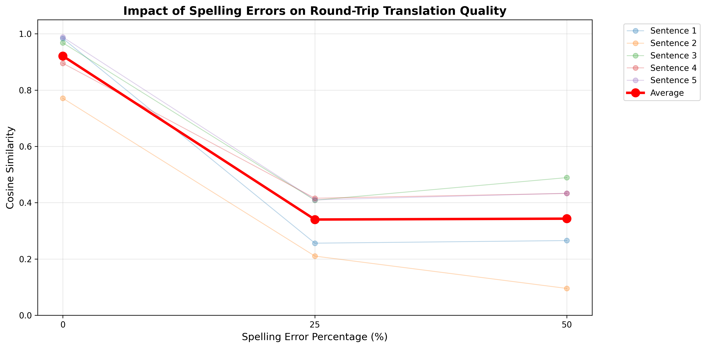

# Product Requirements Document (PRD): LLM Translation Robustness Experiment

## 1. Overview

This document outlines the specifications, workflow, and results of an experiment designed to evaluate the robustness of Large Language Model (LLM) agents in performing multi-step translation tasks. The experiment specifically tests the system's ability to handle input noise (spelling errors) while maintaining semantic integrity through a round-trip translation process (English → French → German → English).

## 2. Objectives

* **Assess Robustness**: Determine how well LLM agents handle varying degrees of spelling errors (0%, 25%, 50%) in input data.
* **Evaluate Semantic Preservation**: Measure the semantic similarity between the original input and the final back-translated output.
* **Demonstrate Multi-Agent Orchestration**: Validate a workflow involving multiple specialized agents working in sequence.

## 3. System Architecture & Tools

### 3.1. Infrastructure

* **Platform**: [opencode](https://opencode.ai/)
* **Model Provider**: GitHub Copilot. We chose this provider because it has non-token-consuming models (see image below).
* **Environment**: VS Code Dev Container.

### 3.2. Agents

Three specialized agents were created using `opencode agent create`:

1. **English-French Translator**: Converts English text to French.
2. **French-German Translator**: Converts French text to German.
3. **German-English Translator**: Converts German text back to English.

### 3.3. Orchestration

* **Command**: A `translation-round-trip` command was implemented to chain these agents together, passing the output of one as the input to the next.

## 4. Data Specifications

### 4.1. Base Dataset

The experiment uses 5 distinct sentences covering diverse topics to ensure broad semantic coverage.

| Sentence ID | Topic | Word Count (Base) | Character Count (Base) |
|-------------|-------|-------------------|------------------------|
| 1 | AI & Financial Analysis | 19 | 161 |
| 2 | Hiking & Meteorology | 22 | 174 |
| 3 | Quantum Mechanics | 21 | 176 |
| 4 | Economics & Climate | 23 | 190 |
| 5 | Renewable Energy | 23 | 183 |

**Aggregate Statistics (Base):**

* Total sentences: 5
* Average words per sentence: 21.6
* Average characters per sentence: 176.8

### 4.2. Test Datasets

Three variations of the dataset were generated to simulate different noise levels:

1. **`0_percent_errors.json`**: The clean, baseline sentences.
2. **`25_percent_errors.json`**: Sentences with approximately 25% of words containing spelling errors.
3. **`50_percent_errors.json`**: Sentences with approximately 50% spelling errors. *Note: This dataset also includes extended sentence structures with additional clauses, increasing complexity beyond just spelling errors.*

## 5. Experiment Methodology

### 5.1. Execution Flow

For each dataset (0%, 25%, 50%):

1. **Input**: Read the source JSON file.
2. **Processing**:
    * Agent 1: English → French
    * Agent 2: French → German
    * Agent 3: German → English
3. **Output**: Save the final English translation to a results JSON file.

### 5.2. Evaluation Metric

* **Tool**: `sentence-transformers` (Model: `all-MiniLM-L6-v2`).
* **Metric**: Cosine Similarity.
* **Comparison**: The embedding of the **Input Sentence** (with errors) is compared against the embedding of the **Final Output Sentence**.

## 6. Results & Analysis

The orchestrated run can be viewed [here](https://opencode.ai/s/B26j4ji1).

### 6.1. Summary of Findings

| Dataset | Avg. Similarity | Min Similarity | Max Similarity | Key Observation |
|---------|-----------------|----------------|----------------|-----------------|
| **0% Errors** | **0.9212** | 0.7710 | 0.9881 | High fidelity. The system preserves meaning almost perfectly when input is clean. |
| **25% Errors** | **0.3402** | 0.2103 | 0.4158 | Low similarity score. This indicates the agents **corrected** the errors. The "clean" output is vectorially distant from the "noisy" input, which is a positive result for error correction. |
| **50% Errors** | **0.3433** | 0.0954 | 0.4891 | Low similarity score. Reflects both error correction and the structural differences (extended length) present in this specific dataset. |

### 6.2. Detailed Analysis

* **Error Correction**: The low similarity scores for the 25% and 50% datasets are counter-intuitive but positive. They suggest that the LLM agents did not merely translate the "noise" (typos) but inferred the intended meaning and produced clean, correct English. Because the evaluation compares the *misspelled* input against the *corrected* output, the vector similarity drops.
* **Robustness**: The system demonstrated high robustness, effectively acting as a denoising auto-encoder while performing translation.

## 7. Conclusion

The multi-agent translation workflow successfully handles noisy input. While the 0% error baseline confirms the translation quality, the 25% and 50% experiments highlight the LLM's inherent ability to correct spelling and grammar errors during the translation process. Future evaluations should compare the *noisy input's output* against the *clean baseline* to get a true measure of semantic recovery.

## 8. References

* [Experiment Results Raw Output](./assets/experiment_results.txt)
