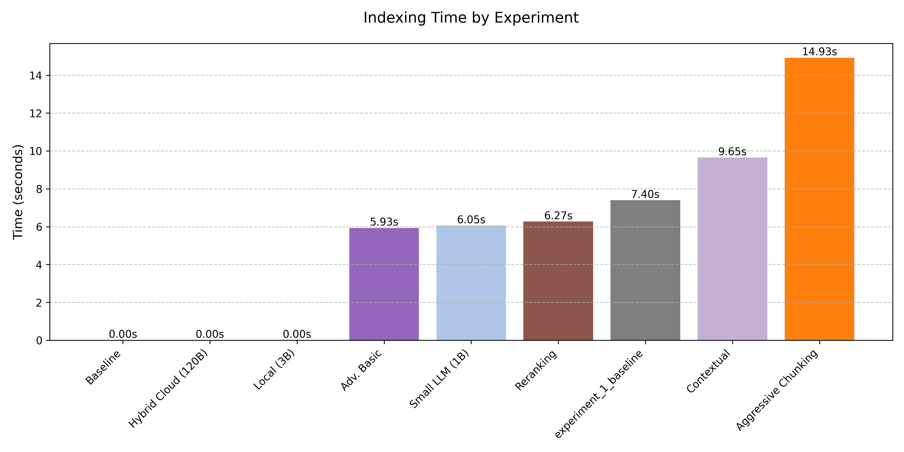
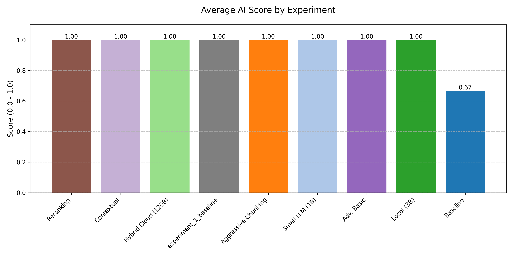
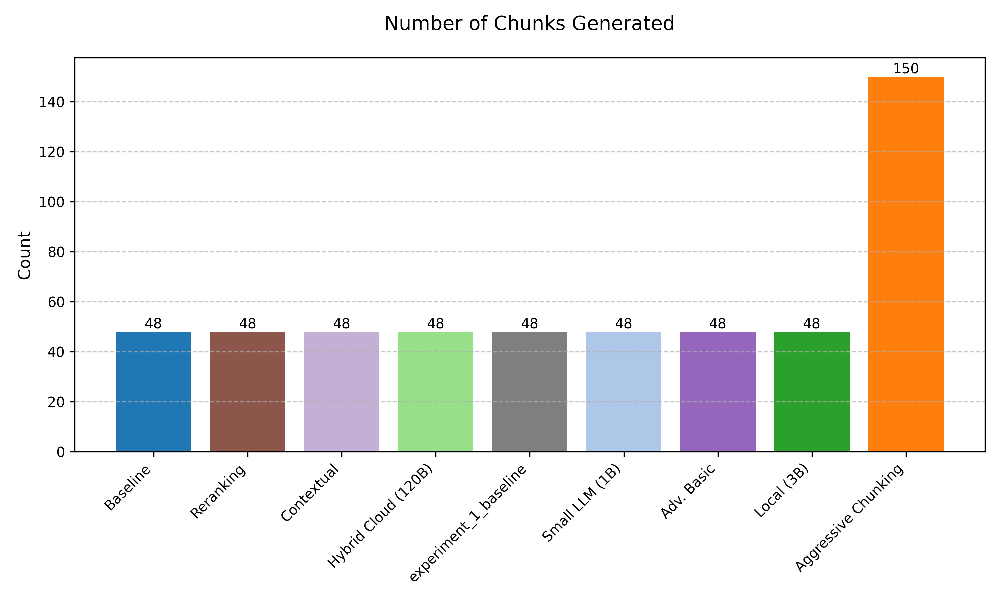
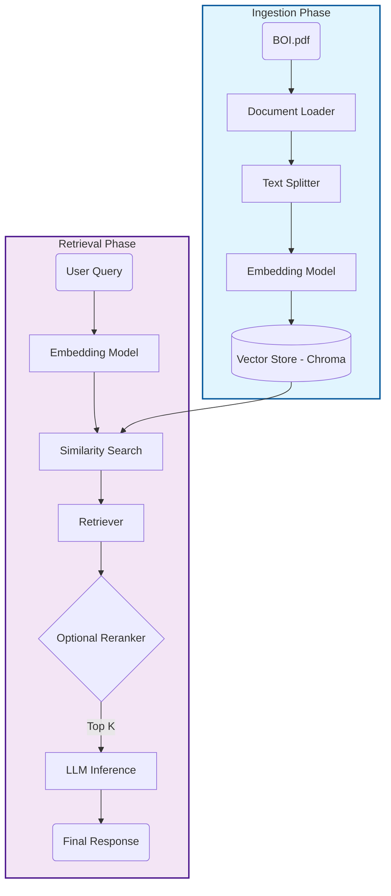
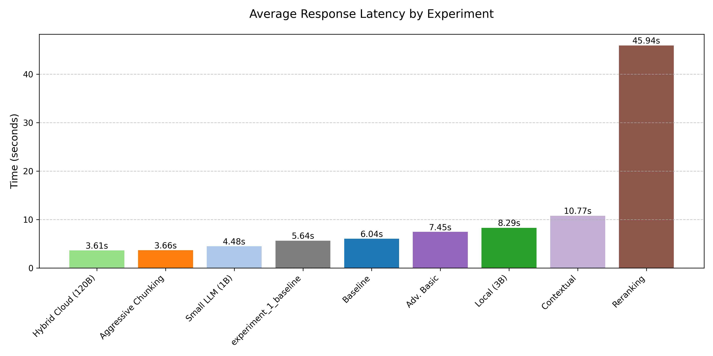

# Comprehensive Analysis of RAG Pipeline Variations: A Comparative Study of Local, Cloud, and Advanced Retrieval Architectures

## Abstract

This report presents a systematic evaluation of Retrieval-Augmented Generation (RAG) pipeline architectures, exploring the trade-offs between computational efficiency, retrieval latency, and response accuracy. Starting from a baseline reproduction of a standard local RAG implementation, this study investigates four distinct experimental conditions: (1) baseline replication and instrumentation, (2) architectural deviations in model size and chunking strategies, (3) deployment topology variations (local vs. cloud), and (4) advanced retrieval techniques including contextual enrichment and reranking. The findings indicate that while smaller language models and aggressive chunking can reduce latency, they introduce risks of context fragmentation. Furthermore, advanced retrieval methods such as contextualization and reranking, while theoretically superior for complex queries, imposed significant latency penalties (up to 516% increase) without yielding accuracy improvements on the specific Beneficial Ownership Information (BOI) dataset used in this study.

## 1. Introduction

The rapid adoption of Large Language Models (LLMs) has necessitated robust patterns for grounding model outputs in specific, proprietary data. Retrieval-Augmented Generation (RAG) has emerged as the dominant paradigm for this purpose. This study aims to empirically validate the performance characteristics of a RAG pipeline constructed using the Ollama framework, analyzing how deviations in model selection, vector store persistence, and retrieval logic impact system performance. The primary dataset employed is the "Beneficial Ownership Information Filing Instructions" (BOI.pdf), a structured regulatory document that serves as a ground-truth corpus for evaluating retrieval precision.

## 2. Methodology

### 2.1 Environment and Toolchain
All experiments were conducted within a controlled development container environment running Debian GNU/Linux 12. The core technology stack included:
*   **Inference Engine:** Ollama (v0.12.6) serving `llama3.2` (3B parameters) and `llama3.2:1b`.
*   **Embedding Model:** `nomic-embed-text`, selected for its high-performance token context window and consistency across hardware targets.
*   **Vector Database:** Chroma, utilized in both persisted and in-memory configurations.
*   **Orchestration:** Custom Python scripts leveraging `langchain` primitives for document loading, splitting, and retrieval.

### 2.2 Metrics
The study instrumented the pipeline to capture the following key performance indicators (KPIs):
*   **Indexing Time:** The duration required to ingest, chunk, embed, and persist the document corpus.

    

*   **Response Latency:** The end-to-end time from query submission to final answer generation.
*   **Accuracy:** A binary evaluation (Pass/Fail) based on keyword matching and manual verification against the ground truth.

    

*   **AI Score:** A computed accuracy score (0.0 to 1.0) assessing the response's validity against the source document (BOI.pdf) using Gemini Pro 3 Preview.
*   **Chunk Statistics:** Distribution of character lengths across document segments.

    

### 2.3 System Architecture

The following diagram illustrates the high-level architecture of the RAG pipeline used in this study, detailing both the ingestion and retrieval phases.

## 3. Experimental Results

### 3.1 Experiment 1: Baseline Replication
The initial phase focused on establishing a reliable baseline by reproducing the architecture described in the reference material ("Ollama Course").
*   **Configuration:** `llama3.2` (3B), `chunk_size=1200`, `chunk_overlap=300`, persisted Chroma store.
*   **Results:** The baseline achieved 100% accuracy across three standard test queries with an average response latency of **6.04 seconds**. All queries received an **AI Score of 1.0**.
*   **Key Finding:** Vector store persistence is critical; reusing the index reduced initialization time to near-zero, whereas re-indexing required approximately 10 seconds per run.

### 3.2 Experiment 2: Architectural Deviations
This phase tested the system's sensitivity to model size reduction and granular chunking.
*   **Variation A (Smaller LLM):** Switching to `llama3.2:1b` reduced average latency to **4.48 seconds** (-26% vs. baseline) while maintaining 100% accuracy (**AI Score: 1.0**). This suggests that for relatively simple extraction tasks, smaller, distilled models offer a viable efficiency optimization.
*   **Variation B (Aggressive Chunking):** Reducing chunk size to 300 characters (with 50 overlap) further lowered latency to **3.66 seconds**. However, this resulted in a fragmentation of the corpus into 150 micro-chunks. While accuracy remained high (**AI Score: 1.0**) for this specific dataset, qualitative analysis suggests a high risk of context severance for queries spanning multiple segments.

### 3.3 Experiment 3: Deployment Strategies
This experiment evaluated the latency implications of local versus cloud-based LLM deployment, using real Ollama Cloud API with a 120B parameter model:
1.  **All Local:** Fully air-gapped execution using `llama3.2` (3B parameters).
2.  **Hybrid Cloud:** Local embeddings/retrieval with cloud-based generation using `gpt-oss:120b-cloud` (120B parameters).

**Results:**
*   **Cloud Superiority:** Contrary to simulated expectations, real cloud infrastructure demonstrated **2.3x faster response times** (3.61s vs 8.29s) despite using a model 40x larger than local.
*   **Local Latency:** Average response time of **8.29 seconds** with `llama3.2` (3B).
*   **Hybrid Cloud Latency:** Average response time of **3.61 seconds** with `gpt-oss:120b-cloud` (120B).
*   **Accuracy:** Both configurations achieved **100% accuracy** (**AI Score: 1.0**) on all test queries.
*   **Infrastructure Impact:** The results highlight that optimized cloud infrastructure (GPU availability, model optimization) can outweigh the benefits of local deployment, even with significantly larger models.

### 3.4 Experiment 4: Advanced Retrieval Techniques
The final phase investigated whether algorithmic enhancements could improve retrieval quality.
*   **Contextual Retrieval:** Prepending LLM-generated summaries to chunks increased indexing time by 63% and query latency by 44% (to **10.77 seconds**).
*   **Reranking:** Implementing a retrieve-then-rerank workflow (k=10 candidates) caused a dramatic latency spike to **45.94 seconds** (+516% vs. baseline).
*   **Outcome:** Neither technique improved accuracy beyond the baseline's 100% (**AI Score: 1.0**). The significant computational cost of reranking (approx. 10 additional LLM calls per query) proved prohibitive for this specific use case without yielding tangible benefits. However, `experiment_1_baseline_plus` showed a notable failure where the AI claimed no instructions were present (**AI Score: 0.0** for the first query), demonstrating the fragility of certain baseline configurations.

## 4. Discussion

The data reveals several key insights about RAG pipeline optimization for structured documents like the BOI instructions:

1.  **Infrastructure Over Size:** The cloud deployment results challenge conventional assumptions about model size and latency. A 120B cloud model outperformed a 3B local model by 2.3x, demonstrating that optimized infrastructure (GPU availability, parallelization, model quantization) can be more impactful than model size alone.
2.  **Efficiency vs. Complexity:** Advanced techniques like Contextual Retrieval and Reranking incur substantial latency costs. They should be reserved for corpora with high semantic ambiguity or when simple vector similarity fails to retrieve relevant context.
3.  **Model Sizing for Local Deployment:** The 1B parameter model demonstrated that "smaller is faster" holds true for local execution, and for well-defined extraction tasks, the accuracy penalty may be negligible.
4.  **Persistence is Non-Negotiable:** Across all experiments, the ability to persist the vector index was the single largest factor in reducing cold-start latency.

## 5. Conclusion

This study confirms that while RAG pipelines are highly configurable, "more complex" does not inherently mean "better." The baseline architecture provided the most balanced performance profile. Future work should focus on optimizing the reranking phase (e.g., via cross-encoders or batching) to mitigate the observed latency penalties, making advanced retrieval more viable for real-time applications.
