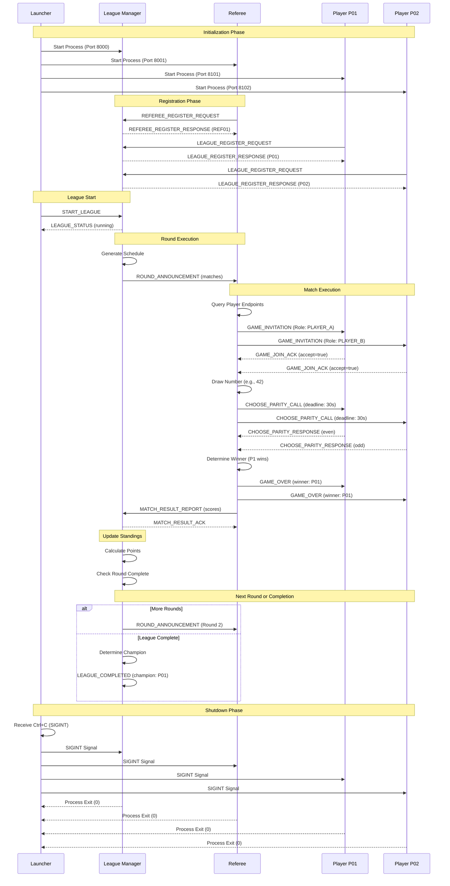
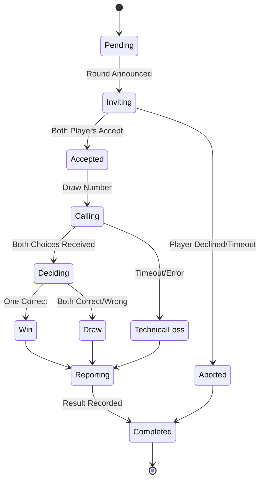
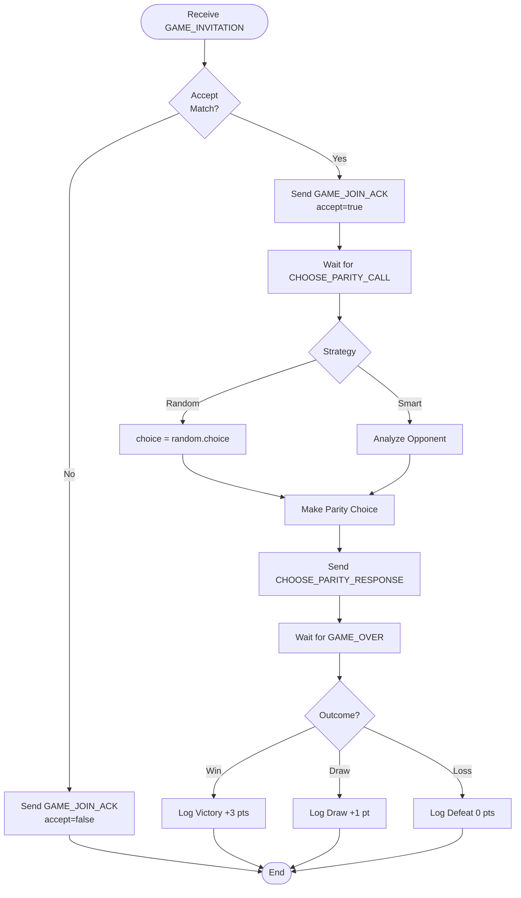

# Product Requirements Document: Multi-Agent League Management System

**Version:** 1.0  
**Date:** December 25, 2025  
**Status:** Implemented

---

## Table of Contents

1. [Executive Summary](#executive-summary)
2. [System Overview](#system-overview)
3. [Architecture](#architecture)
4. [Actors and Agents](#actors-and-agents)
5. [Message Protocol](#message-protocol)
6. [System Workflows](#system-workflows)
7. [Functional Requirements](#functional-requirements)
8. [Non-Functional Requirements](#non-functional-requirements)
9. [Technical Specifications](#technical-specifications)
10. [Flow Diagrams](#flow-diagrams)
11. [API Endpoints](#api-endpoints)
12. [Error Handling](#error-handling)
13. [Future Enhancements](#future-enhancements)

---

## Executive Summary

The Multi-Agent League Management System is a distributed microservice architecture designed to orchestrate competitive game leagues between autonomous AI agents. The system manages player registration, referee coordination, match scheduling, game execution, and standings calculation for the "Even/Odd" game type.

### Key Features

- **Autonomous Agent Coordination**: Multiple independent services communicate via RESTful message protocol
- **Round-Robin Tournament**: Fair scheduling algorithm ensuring all players face each other
- **Real-time Match Execution**: Asynchronous game processing with concurrent match support
- **Comprehensive Logging**: Structured logging with Loguru for debugging and monitoring
- **Graceful Lifecycle Management**: Clean startup and shutdown sequences with signal handling

---

## System Overview

### Purpose

The system facilitates automated competitive gaming leagues where:
- **Players** register and compete in matches
- **Referees** enforce rules, manage game state, and report results
- **League Manager** coordinates the entire tournament lifecycle

### Game Type: Even/Odd

A simple probability-based game where:
1. Referee draws a random number (0-100)
2. Each player predicts whether the number is even or odd
3. Both correct or both wrong = Draw (1 point each)
4. One correct = Winner gets 3 points

### Technology Stack

- **Language**: Python 3.13+
- **Framework**: FastAPI with Uvicorn
- **HTTP Client**: httpx (async)
- **Logging**: Loguru
- **Time Handling**: Arrow
- **Validation**: Pydantic v2
- **Orchestration**: asyncio

---

## Architecture

### System Components

```
┌─────────────────────────────────────────────────────────┐
│                       Launcher                          │
│          (Process Orchestrator & Monitor)               │
└────────────────────┬────────────────────────────────────┘
                     │
        ┌────────────┼────────────┬──────────────┐
        │            │            │              │
        ▼            ▼            ▼              ▼
┌──────────┐  ┌──────────┐  ┌─────────┐   ┌─────────┐
│  League  │  │ Referee  │  │ Player  │   │ Player  │
│ Manager  │  │  (REF01) │  │  (P01)  │   │  (P02)  │
│  :8000   │  │  :8001   │  │  :8101  │   │  :8102  │
└──────────┘  └──────────┘  └─────────┘   └─────────┘
      │             │             │              │
      └─────────────┴─────────────┴──────────────┘
                    │
            Message Protocol (MCP)
              HTTP JSON RPC
```

### Service Responsibilities

#### League Manager (Port 8000)
- Accept player and referee registrations
- Generate round-robin match schedules
- Coordinate round execution
- Track standings and scores
- Declare winners and champions

#### Referee (Port 8001)
- Register with League Manager
- Receive round announcements
- Query player endpoints
- Execute individual matches
- Report match results

#### Players (Ports 8101-8104)
- Register with League Manager
- Accept game invitations
- Make parity choices (even/odd)
- Receive game results

#### Launcher
- Start all services in correct order
- Monitor process health
- Handle graceful shutdown with SIGINT/SIGTERM/SIGKILL

---

## Actors and Agents

### Agent Types

| Agent Type      | Count | Ports      | Key Behaviors |
|----------------|-------|------------|---------------|
| League Manager | 1     | 8000       | Coordinator, Scheduler, Score Keeper |
| Referee        | 1     | 8001       | Game Master, Rule Enforcer |
| Player         | N (4) | 8101-8104  | Competitor, Decision Maker |
| Launcher       | 1     | N/A        | Orchestrator, Monitor |

### Agent Lifecycle

```
┌─────────┐     ┌──────────┐     ┌─────────┐     ┌──────────┐
│ STARTUP │────▶│ REGISTER │────▶│ PLAYING │────▶│ SHUTDOWN │
└─────────┘     └──────────┘     └─────────┘     └──────────┘
     │               │                 │               │
     ▼               ▼                 ▼               ▼
Initialize      Send metadata    Receive matches   Cleanup
Endpoints       to LM/Ref        Execute logic     Release resources
```

---

## Message Protocol

### Protocol Specification

- **Protocol Version**: `league.v2`
- **Transport**: HTTP POST
- **Encoding**: JSON
- **Endpoint**: `/mcp` (Message Communication Protocol)
- **Content-Type**: `application/json`

### Base Message Structure

```python
{
    "protocol": "league.v2",
    "message_type": "<MESSAGE_TYPE>",
    "sender": "<agent_id>",
    "timestamp": "<ISO8601>",
    "conversation_id": "<UUID>",
    # ... message-specific fields
}
```

### Message Types

#### Registration Messages
- `LEAGUE_REGISTER_REQUEST` / `LEAGUE_REGISTER_RESPONSE`
- `REFEREE_REGISTER_REQUEST` / `REFEREE_REGISTER_RESPONSE`

#### Game Control Messages
- `START_LEAGUE`
- `LEAGUE_STATUS`
- `ROUND_ANNOUNCEMENT`
- `ROUND_COMPLETED`

#### Match Execution Messages
- `GAME_INVITATION`
- `GAME_JOIN_ACK`
- `CHOOSE_PARITY_CALL`
- `CHOOSE_PARITY_RESPONSE`
- `GAME_OVER`

#### Reporting Messages
- `MATCH_RESULT_REPORT`
- `MATCH_RESULT_ACK`
- `LEAGUE_STANDINGS_UPDATE`
- `LEAGUE_COMPLETED`

#### Query & Error Messages
- `LEAGUE_QUERY` / `LEAGUE_QUERY_RESPONSE`
- `LEAGUE_ERROR`
- `GAME_ERROR`

---

## System Workflows

### 1. Initialization Sequence

```
Launcher          League Manager    Referee         Players
   |                    |              |               |
   |--Start Process---->|              |               |
   |--Start Process-------------------->|               |
   |--Start Process------------------------------------->|
   |                    |              |               |
   |                    |              |--Register----->|
   |                    |<-------------+               |
   |                    |              |               |
   |                    |<--------------------Register--+
   |                    |----Response------------------>|
   |                    |              |               |
```

### 2. League Execution Sequence

```
Launcher         League Manager    Referee         Players
   |                    |              |               |
   |--START_LEAGUE----->|              |               |
   |<--LEAGUE_STATUS----+              |               |
   |                    |              |               |
   |                    |--Generate----|              |
   |                    |   Schedule   |               |
   |                    |              |               |
   |                    |--ROUND_ANNOUNCEMENT--------->|
   |                    |              |               |
   |                    |              |--GAME_INVITATION->|
   |                    |              |<-GAME_JOIN_ACK---|
   |                    |              |               |
   |                    |              |--CHOOSE_PARITY-->|
   |                    |              |<-PARITY_CHOICE---|
   |                    |              |               |
   |                    |              |--GAME_OVER------->|
   |                    |              |               |
   |                    |<-MATCH_RESULT_REPORT---------+
   |                    |--MATCH_RESULT_ACK----------->|
   |                    |              |               |
   |                    |--Update Standings            |
   |                    |              |               |
```

### 3. Match Execution Detail

```
Referee                Player A              Player B
   |                       |                     |
   |--GAME_INVITATION----->|                     |
   |--GAME_INVITATION---------------------->|     |
   |<-GAME_JOIN_ACK--------|                     |
   |<-GAME_JOIN_ACK--------------------------|    |
   |                       |                     |
   |--Draw Number (42)-----|                     |
   |                       |                     |
   |--CHOOSE_PARITY_CALL-->|                     |
   |--CHOOSE_PARITY_CALL------------------------>|
   |                       |                     |
   |<-"even"---------------|                     |
   |<-"odd"-------------------------------------|
   |                       |                     |
   |--Determine Winner-----|                     |
   |                       |                     |
   |--GAME_OVER----------->|                     |
   |--GAME_OVER----------------------------------->|
   |                       |                     |
```

---

## Functional Requirements

### FR-1: Agent Registration

**Priority**: P0  
**Status**: ✅ Implemented

**Requirements**:
- FR-1.1: Players must register with League Manager providing display name, version, game types, and contact endpoint
- FR-1.2: Referee must register with League Manager providing metadata and max concurrent matches
- FR-1.3: League Manager must assign unique IDs (P01, P02, etc.) to players
- FR-1.4: Registration must return acceptance/rejection with assigned ID

### FR-2: Match Scheduling

**Priority**: P0  
**Status**: ✅ Implemented

**Requirements**:
- FR-2.1: League Manager must generate round-robin schedule ensuring all players face each other
- FR-2.2: Schedule must randomize player roles (A vs B) to prevent bias
- FR-2.3: Handle odd number of players with "BYE" placeholder
- FR-2.4: Support multiple rounds (n-1 rounds for n players)

### FR-3: Game Execution

**Priority**: P0  
**Status**: ✅ Implemented

**Requirements**:
- FR-3.1: Referee must invite both players to match
- FR-3.2: Players must accept/decline invitations within timeout (5s)
- FR-3.3: Referee draws random number (0-100)
- FR-3.4: Players submit parity choices within deadline (30s)
- FR-3.5: Referee determines winner based on correctness
- FR-3.6: Award 3 points for win, 1 point for draw, 0 for loss

### FR-4: Standings Management

**Priority**: P0  
**Status**: ✅ Implemented

**Requirements**:
- FR-4.1: Track wins, losses, draws, points for each player
- FR-4.2: Update standings after each match
- FR-4.3: Rank players by total points (descending)
- FR-4.4: Declare champion after all rounds complete

### FR-5: Error Handling

**Priority**: P0  
**Status**: ✅ Implemented

**Requirements**:
- FR-5.1: Handle player timeouts (technical loss)
- FR-5.2: Handle connection failures gracefully
- FR-5.3: Log all errors with context
- FR-5.4: Continue league execution despite individual match failures

### FR-6: Lifecycle Management

**Priority**: P0  
**Status**: ✅ Implemented

**Requirements**:
- FR-6.1: Support clean startup sequence
- FR-6.2: Support graceful shutdown with SIGINT/SIGTERM
- FR-6.3: Force kill after timeout (5s) with SIGKILL
- FR-6.4: Wait for all child processes to exit

---

## Non-Functional Requirements

### NFR-1: Performance

- NFR-1.1: Support concurrent match execution (10+ matches)
- NFR-1.2: Match completion within 60 seconds
- NFR-1.3: League Manager response time < 100ms

### NFR-2: Scalability

- NFR-2.1: Support 4-16 players per league
- NFR-2.2: Horizontal scaling of referee instances
- NFR-2.3: Stateless player agents for easy scaling

### NFR-3: Reliability

- NFR-3.1: 99.9% uptime during league execution
- NFR-3.2: Automatic retry on transient failures
- NFR-3.3: Comprehensive logging for debugging

### NFR-4: Maintainability

- NFR-4.1: Structured logging with Loguru
- NFR-4.2: Type hints on all public interfaces
- NFR-4.3: Pydantic validation for all messages
- NFR-4.4: Clear separation of concerns (MVC pattern)

### NFR-5: Observability

- NFR-5.1: Debug-level logs for match execution
- NFR-5.2: Info-level logs for lifecycle events
- NFR-5.3: Error logs with full stack traces
- NFR-5.4: Success logs for major milestones

---

## Technical Specifications

### Development Environment

```toml
[dependency-groups]
hw7 = [
    "arrow>=1.4.0",
    "fastapi[standard]>=0.127.0",
    "httpx>=0.27.0",
    "uvicorn>=0.38.0",
    "loguru>=0.7.3",
]
```

### Python Version

- Minimum: Python 3.13
- Target: Python 3.13+

### Service Configuration

| Service        | Port | Workers | Timeout |
|---------------|------|---------|---------|
| League Manager| 8000 | 1       | 30s     |
| Referee       | 8001 | 1       | 60s     |
| Player 1      | 8101 | 1       | 30s     |
| Player 2      | 8102 | 1       | 30s     |
| Player 3      | 8103 | 1       | 30s     |
| Player 4      | 8104 | 1       | 30s     |

### Message Serialization

- **Encoding**: UTF-8 JSON
- **Timestamp Format**: ISO 8601 with timezone
- **UUID Version**: UUID v4
- **Pydantic Mode**: `model_dump(mode="json")`

### Signal Handling

```python
Shutdown Sequence:
1. SIGINT  → Wait 5s
2. SIGTERM → Wait 5s
3. SIGKILL → Immediate
```

---

## Flow Diagrams

### Complete System Flow



### Match State Machine



### Player Decision Flow



---

## API Endpoints

### League Manager: POST /mcp

#### Accepts

- `LEAGUE_REGISTER_REQUEST`
- `REFEREE_REGISTER_REQUEST`
- `START_LEAGUE`
- `MATCH_RESULT_REPORT`
- `LEAGUE_QUERY`

#### Returns

- `LEAGUE_REGISTER_RESPONSE`
- `REFEREE_REGISTER_RESPONSE`
- `LEAGUE_STATUS`
- `MATCH_RESULT_ACK`
- `LEAGUE_QUERY_RESPONSE`

### Referee: POST /mcp

#### Accepts

- `ROUND_ANNOUNCEMENT`

#### Returns

- `{status: "received"}`

### Player: POST /mcp

#### Accepts

- `GAME_INVITATION` → Returns `GAME_JOIN_ACK`
- `CHOOSE_PARITY_CALL` → Returns `CHOOSE_PARITY_RESPONSE`
- `GAME_OVER` → Returns `{status: "ok"}`

---

## Error Handling

### Error Categories

#### 1. Network Errors

- **Connection Refused**: Service not started
- **Timeout**: Service not responding within deadline
- **Connection Reset**: Service crashed during request

**Handling**: Retry with exponential backoff, log error, mark as technical loss

#### 2. Validation Errors

- **Invalid Message Format**: Missing required fields
- **Unknown Message Type**: Unsupported protocol version
- **Pydantic Validation**: Type mismatch, out of range

**Handling**: Return error response, log with full context, reject request

#### 3. Business Logic Errors

- **Duplicate Registration**: Player already registered
- **Invalid State**: Action not allowed in current state
- **Match Conflict**: Player already in active match

**Handling**: Return error response with reason, maintain system state

#### 4. System Errors

- **Out of Memory**: Too many concurrent operations
- **Process Crash**: Unexpected termination
- **Deadlock**: Circular wait condition

**Handling**: Log stack trace, attempt graceful degradation, alert monitoring

### Error Message Format

```python
{
    "protocol": "league.v2",
    "message_type": "LEAGUE_ERROR" | "GAME_ERROR",
    "sender": "<service_id>",
    "timestamp": "<ISO8601>",
    "conversation_id": "<UUID>",
    "error_code": "TIMEOUT" | "VALIDATION" | "STATE" | "SYSTEM",
    "error_description": "Human readable message",
    "original_message_type": "<MESSAGE_TYPE>",
    "context": {
        "stack_trace": "...",
        "request_data": {...}
    }
}
```

---

## Future Enhancements

### Phase 2: Multi-Game Support

- Add Rock-Paper-Scissors game type
- Add Tic-Tac-Toe game type
- Support mixed-game tournaments

### Phase 3: Advanced Scheduling

- Swiss-system tournaments
- Bracket elimination
- Group stage + knockout

### Phase 4: Observability

- Prometheus metrics endpoint
- Grafana dashboards
- Real-time WebSocket updates
- Replay system for match review

### Phase 5: AI Integration

- OpenAI-powered strategy agents
- Reinforcement learning players
- Performance analytics
- Strategy recommendation engine

### Phase 6: Web Interface

- React dashboard for live monitoring
- Match replay visualization
- Player statistics and leaderboards
- Admin control panel

### Phase 7: Distributed Mode

- Kubernetes deployment
- Multi-region support
- Load balancing across referees
- Persistent storage (PostgreSQL)

### Phase 8: Security & Auth

- JWT authentication
- Rate limiting
- Player API keys
- Audit logging

---

## Appendix

### Glossary

- **MCP**: Message Communication Protocol
- **Round-Robin**: Tournament format where each participant faces all others
- **Parity**: Property of being even or odd
- **Technical Loss**: Loss due to timeout or connection failure
- **Lifespan**: FastAPI context manager for startup/shutdown

### References

- [FastAPI Documentation](https://fastapi.tiangolo.com/)
- [Loguru Documentation](https://loguru.readthedocs.io/)
- [Pydantic V2 Documentation](https://docs.pydantic.dev/)
- [Arrow Documentation](https://arrow.readthedocs.io/)

### Version History

| Version | Date       | Changes                              | Author |
|---------|------------|--------------------------------------|--------|
| 1.0     | 2025-12-25 | Initial PRD with complete implementation | System |

---

**Document Owner**: Multi-Agent League System Team  
**Last Updated**: December 25, 2025  
**Status**: Living Document - Updated with each major release
