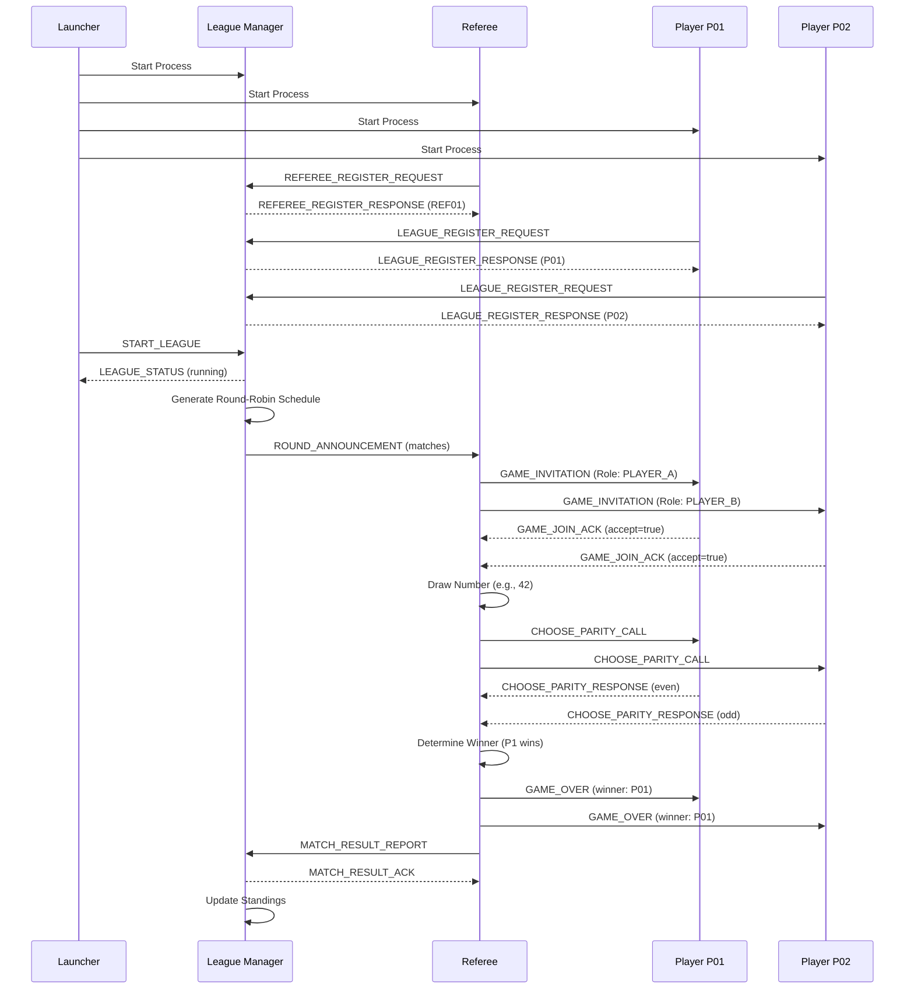

# Multi-Agent League Management System

A distributed microservice architecture for orchestrating competitive game leagues between autonomous AI agents using the Even/Odd game.

## 🎯 Overview

This system demonstrates advanced multi-agent orchestration where independent services (League Manager, Referee, and Players) communicate via a structured message protocol to run competitive tournaments. The architecture showcases:

- **Asynchronous message-based communication** using RESTful HTTP/JSON
- **Autonomous agent coordination** with distributed decision-making
- **Round-robin tournament scheduling** with fair matchmaking
- **Real-time game execution** with concurrent match support
- **Comprehensive lifecycle management** with graceful shutdown

## 🏗️ Architecture

```
┌─────────────────────────────────────────────────────────┐
│                       Launcher                          │
│          (Process Orchestrator & Monitor)               │
└────────────────────┬────────────────────────────────────┘
                     │
        ┌────────────┼────────────┬──────────────┐
        │            │            │              │
        ▼            ▼            ▼              ▼
┌──────────┐  ┌──────────┐  ┌─────────┐   ┌─────────┐
│  League  │  │ Referee  │  │ Player  │   │ Player  │
│ Manager  │  │  (REF01) │  │  (P01)  │   │  (P02)  │
│  :8000   │  │  :8001   │  │  :8101  │   │  :8102  │
└──────────┘  └──────────┘  └─────────┘   └─────────┘
      │             │             │              │
      └─────────────┴─────────────┴──────────────┘
                    │
            Message Protocol (MCP)
              HTTP JSON RPC
```

### Components

| Component | Port | Responsibility |
|-----------|------|----------------|
| **League Manager** | 8000 | Tournament coordination, scheduling, standings tracking |
| **Referee** | 8001 | Game execution, rule enforcement, result reporting |
| **Player 1-4** | 8101-8104 | Competitive gameplay, strategy execution |
| **Launcher** | N/A | Process orchestration, health monitoring, shutdown management |

## 🎮 Game: Even/Odd

A probability-based game where:
1. Referee draws a random number (0-100)
2. Each player predicts whether the number is even or odd
3. Scoring:
   - **Both correct or both wrong**: Draw (1 point each)
   - **One correct**: Winner gets 3 points, loser gets 0

## 🚀 Quick Start

### Prerequisites

- Python 3.13+
- UV package manager (or pip)
- Terminal with support for colored output (optional)

### Installation

```bash
# Navigate to HW7 directory
cd HW7

# Install dependencies
uv pip install -r requirements.txt

# OR using pip
pip install -r requirements.txt
```

### Running the League

```bash
# From the project root directory
python HW7/launcher.py
```

The launcher will:
1. Start the League Manager (port 8000)
2. Start the Referee (port 8001)
3. Start 4 Players (ports 8101-8104)
4. Wait for registration (5 seconds)
5. Send START_LEAGUE command
6. Monitor the league execution

### Stopping the League

Press `Ctrl+C` to gracefully shutdown all services. The launcher will:
1. Send SIGINT to all processes
2. Wait 5 seconds for graceful shutdown
3. Send SIGTERM if processes don't respond
4. Send SIGKILL as a last resort

## 📁 Project Structure

```
HW7/
├── launcher.py              # Main entry point - orchestrates all services
├── league_manager/          # Tournament coordinator
│   ├── __init__.py
│   └── main.py             # Scheduling, standings, registration
├── referee/                 # Game executor
│   ├── __init__.py
│   └── main.py             # Match execution, rule enforcement
├── player/                  # Competitive agent
│   ├── __init__.py
│   └── main.py             # Strategy, decision-making
├── shared/                  # Common contracts
│   ├── __init__.py
│   ├── enums.py            # Message types, game types, error codes
│   └── schemas.py          # Pydantic models for all messages
├── CONTRACTS.md            # Complete message protocol specification
├── PRD.md                  # Product requirements and system design
├── requirements.txt        # Python dependencies
└── README.md               # This file
```

## 🔌 Message Protocol

All agents communicate via HTTP POST to `/mcp` endpoints using the **league.v2** protocol.

### Key Message Types

#### Registration Phase
- `LEAGUE_REGISTER_REQUEST` / `LEAGUE_REGISTER_RESPONSE` - Player registration
- `REFEREE_REGISTER_REQUEST` / `REFEREE_REGISTER_RESPONSE` - Referee registration

#### Game Execution
- `START_LEAGUE` - Launcher triggers tournament start
- `ROUND_ANNOUNCEMENT` - League Manager distributes match schedule
- `GAME_INVITATION` - Referee invites players to match
- `GAME_JOIN_ACK` - Player accepts/declines invitation
- `CHOOSE_PARITY_CALL` - Referee requests parity choice
- `CHOOSE_PARITY_RESPONSE` - Player submits even/odd prediction
- `GAME_OVER` - Referee announces match result
- `MATCH_RESULT_REPORT` - Referee reports to League Manager

#### Standings & Status
- `LEAGUE_STANDINGS_UPDATE` - Current rankings after each round
- `ROUND_COMPLETED` - Round summary statistics
- `LEAGUE_COMPLETED` - Final results and champion announcement

See [CONTRACTS.md](CONTRACTS.md) for complete protocol specification with examples.

## 📊 System Workflows

### Typical League Execution Flow



## 🛠️ Technical Stack

- **Language**: Python 3.13+
- **Web Framework**: FastAPI 0.127.0+ with Uvicorn
- **Async HTTP**: httpx 0.27.0+
- **Logging**: Loguru 0.7.3+
- **Time Handling**: Arrow 1.4.0+
- **Validation**: Pydantic v2
- **Concurrency**: asyncio

## 🔧 Configuration

The system uses **pydantic-settings** to manage configuration through environment variables and a `.env` file. All configuration is centralized in `shared/settings.py`.

### Configuration Files

- **`.env`** - Active configuration (git-ignored, create from `.env.example`)
- **`.env.example`** - Template with all available settings and documentation
- **`shared/settings.py`** - Settings class using pydantic-settings BaseSettings

### Quick Configuration Setup

```bash
# Copy the example file to create your .env
cp HW7/.env.example HW7/.env

# Edit the .env file with your preferred settings
nano HW7/.env
```

### Available Configuration Options

#### League Manager
- `LEAGUE_MANAGER_HOST` - Host address (default: `0.0.0.0`)
- `LEAGUE_MANAGER_PORT` - Port number (default: `8000`)
- `LEAGUE_ID` - Unique league identifier (default: `league_2025_even_odd`)

#### Referee
- `REFEREE_HOST` - Host address (default: `0.0.0.0`)
- `REFEREE_PORT` - Port number (default: `8001`)
- `REFEREE_ID` - Unique referee identifier (default: `REF01`)
- `REFEREE_DISPLAY_NAME` - Display name (default: `Referee Alpha`)
- `REFEREE_VERSION` - Version string (default: `1.0.0`)
- `REFEREE_MAX_CONCURRENT_MATCHES` - Max concurrent matches (default: `10`)

#### Players
- `PLAYER_BASE_PORT` - Starting port for players (default: `8101`)
- `PLAYER_HOST` - Host address (default: `0.0.0.0`)
- `PLAYER_IDS` - Comma-separated player IDs (default: `P01,P02,P03,P04`)
- `PLAYER_VERSION` - Version string (default: `1.0.0`)

#### Game Settings
- `GAME_TYPE` - Game type identifier (default: `even_odd`)
- `GAME_INVITATION_TIMEOUT` - Invitation timeout in seconds (default: `5`)
- `PARITY_CHOICE_TIMEOUT` - Choice timeout in seconds (default: `30`)
- `HTTP_REQUEST_TIMEOUT` - HTTP timeout in seconds (default: `10`)
- `RANDOM_NUMBER_MIN` - Minimum random number (default: `0`)
- `RANDOM_NUMBER_MAX` - Maximum random number (default: `100`)

#### Launcher Settings
- `STARTUP_WAIT_TIME` - Time to wait for services to start (default: `5`)
- `SHUTDOWN_SIGINT_TIMEOUT` - SIGINT timeout in seconds (default: `5`)
- `SHUTDOWN_SIGTERM_TIMEOUT` - SIGTERM timeout in seconds (default: `5`)

#### Logging
- `LOG_LEVEL` - Logging level: `DEBUG`, `INFO`, `WARNING`, `ERROR`, `CRITICAL` (default: `DEBUG`)

### Example Configuration

```env
# Change ports if you have conflicts
LEAGUE_MANAGER_PORT=9000
REFEREE_PORT=9001
PLAYER_BASE_PORT=9101

# Run more or fewer players
PLAYER_IDS=P01,P02,P03,P04,P05,P06

# Adjust game parameters
RANDOM_NUMBER_MAX=1000
PARITY_CHOICE_TIMEOUT=60

# Change log verbosity
LOG_LEVEL=INFO
```

### Using Custom Configuration

The settings are automatically loaded when you import from `shared.settings`:

```python
from shared.settings import settings

# Access configuration
port = settings.league_manager_port
league_id = settings.league_id
player_list = settings.player_ids_list  # Parsed from comma-separated string
```

**Note**: Previously, configuration was hardcoded in each file. Now all settings are externalized to the `.env` file for easy management without code changes.

## 📝 Development

### Code Style

- **Type Hints**: All public functions use Python type hints
- **Async/Await**: Extensive use of asyncio for concurrent operations
- **Pydantic Models**: Strict schema validation for all messages
- **Structured Logging**: Loguru with context-rich log messages

### Error Handling

The system implements comprehensive error handling:

- **Timeouts**: Automatic technical loss on player timeouts
- **Connection Failures**: Graceful degradation with detailed logging
- **Validation Errors**: Pydantic validation with clear error messages
- **State Management**: Careful tracking of game/league state

### Signal Handling

The launcher implements graceful shutdown:

```
SIGINT (Ctrl+C) → Wait 5s → SIGTERM → Wait 5s → SIGKILL
```

## 🎓 Learning Objectives

This project demonstrates:

1. **Multi-Agent Systems**: Coordinating autonomous services with different responsibilities
2. **Distributed Coordination**: Message-based communication without shared state
3. **Protocol Design**: Well-defined contracts between services
4. **Async Programming**: Non-blocking I/O with asyncio and FastAPI
5. **Process Management**: Subprocess orchestration and lifecycle management
6. **Error Resilience**: Handling failures in distributed systems

## 📚 Documentation

- **[PRD.md](PRD.md)** - Complete product requirements, system design, and flow diagrams
- **[CONTRACTS.md](CONTRACTS.md)** - Detailed message protocol specification with examples
- **Code Comments** - Inline documentation for complex logic

## 🔮 Future Enhancements

Planned improvements include:

- **Testing Suite**: Unit and integration tests with pytest
- **Configuration Management**: Environment variables and YAML config
- **Analytics**: Jupyter notebooks for game fairness analysis
- **Multiple Game Types**: Rock-Paper-Scissors, Tic-Tac-Toe
- **Advanced Tournaments**: Swiss-system, bracket elimination
- **Observability**: Prometheus metrics, Grafana dashboards
- **Web Interface**: Real-time React dashboard
- **Distributed Deployment**: Kubernetes support

## 🐛 Troubleshooting

### Port Already in Use

If you see "Address already in use" errors:

```bash
# Find and kill processes using the ports
lsof -ti:8000,8001,8101,8102,8103,8104 | xargs kill -9
```

### Services Not Starting

Check that you have Python 3.13+ installed:

```bash
python --version  # Should be 3.13 or higher
```

### Import Errors

Ensure you're running from the correct directory:

```bash
# Should be in the parent directory of HW7
pwd  # Should end with /llms-and-multi-agent-orchestration
python HW7/launcher.py
```

## 📄 License

This is an academic project for coursework in Multi-Agent Orchestration.

## 👥 Authors

Created as part of MSc Machine Learning and Data Science coursework.

---

**Last Updated**: December 25, 2025  
**Version**: 1.0  
**Protocol Version**: league.v2
