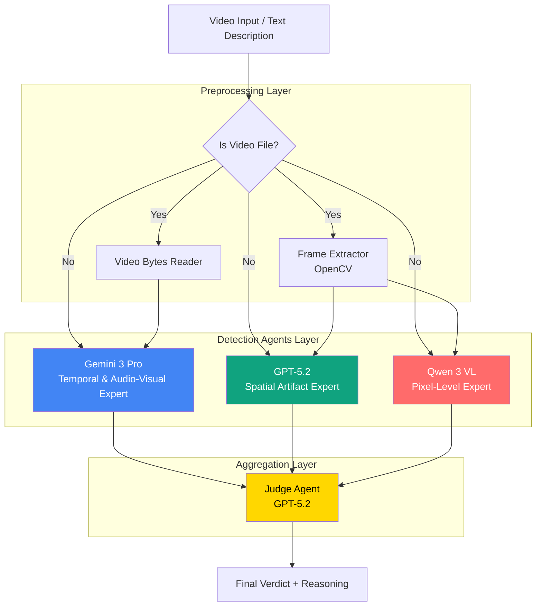
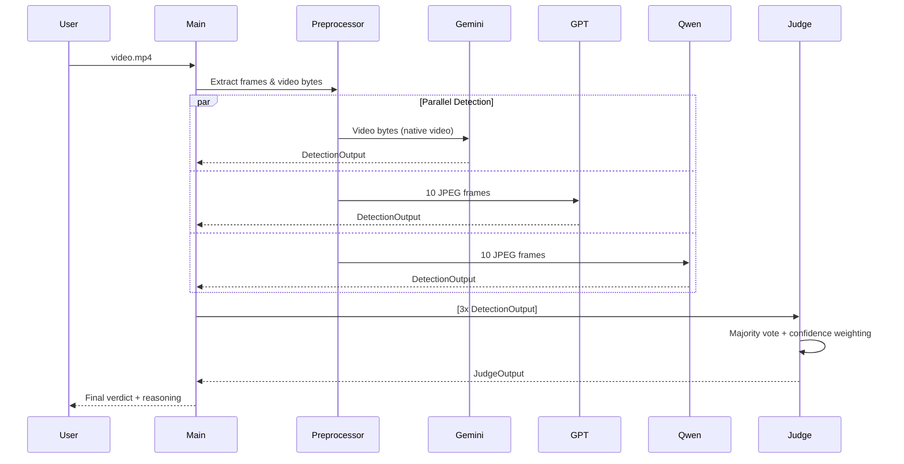
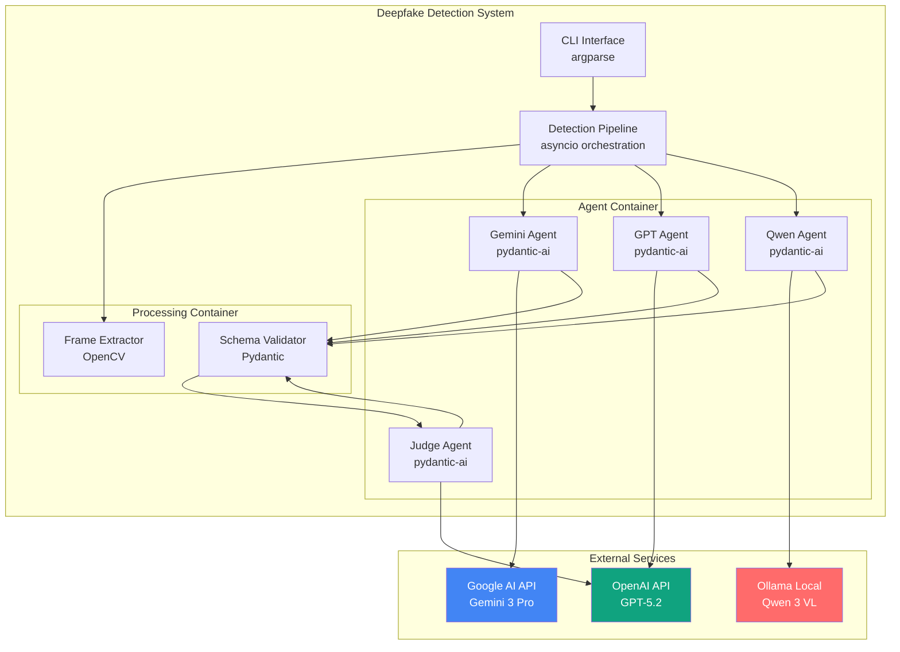
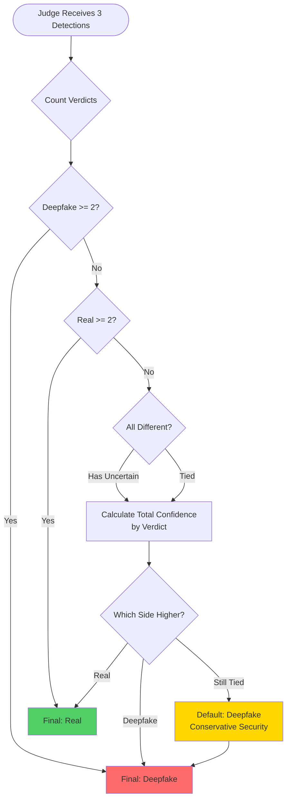

# Deepfake Detection System

A production-ready multi-agent AI application that leverages state-of-the-art multimodal Large Language Models (LLMs) to detect deepfake videos with high accuracy. The system employs a "Council of Experts" architecture where three specialized detection agents analyze videos independently, and a Judge agent aggregates their findings to produce a final verdict.

## Table of Contents

- [Overview](#overview)
- [Architecture](#architecture)
- [Features](#features)
- [Installation](#installation)
- [Configuration](#configuration)
- [Usage](#usage)
- [System Components](#system-components)
- [How It Works](#how-it-works)
- [Project Structure](#project-structure)
- [Testing](#testing)
- [Technical Details](#technical-details)

## Overview

The Deepfake Detection System addresses the growing challenge of synthetic media by combining multiple SOTA models from different providers (Google, OpenAI, Open Source) to cross-validate artifacts and increase detection reliability. By using a multi-agent approach, the system minimizes blind spots inherent in single-model detection.

### Key Capabilities

- **Multi-Model Analysis**: Orchestrates three cutting-edge vision-language models
- **Temporal & Spatial Analysis**: Examines both frame-level artifacts and temporal continuity
- **Structured Output**: Returns typed, validated JSON responses via Pydantic
- **Graceful Degradation**: Falls back to text-based analysis if video processing fails
- **Async Pipeline**: Non-blocking parallel execution of all detection agents

## Architecture

### High-Level System Architecture



### Data Flow Diagram



### C4 Container Diagram



### Decision Logic Flow



## Features

- **State-of-the-Art Models (January 2026)**:
  - Gemini 3 Pro (Preview) - Native video understanding
  - GPT-5.2 - Advanced multimodal analysis
  - Qwen 3 VL - Latest open-source vision-language model

- **Specialized Detection**:
  - Visual artifacts (blending, warping, aliasing)
  - Temporal inconsistencies and jitter
  - Audio-visual synchronization issues
  - Lighting and shadow anomalies
  - Pixel-level compression artifacts

- **Robust Engineering**:
  - Typed configuration with environment variables
  - Structured output validation via Pydantic
  - Comprehensive error handling with graceful fallbacks
  - Async parallel execution for optimal performance
  - Retry logic via `pydantic-ai` for schema validation

## Installation

### Prerequisites

- Python 3.12+
- `uv` package manager (recommended) or `pip`
- OpenCV for video processing
- API keys for Google AI and OpenAI
- Ollama installed locally (for Qwen 3 VL)

### Install Dependencies

Using `uv` (recommended):

```bash
uv pip install -r requirements.txt
```

Using `pip`:

```bash
pip install -r requirements.txt
```

### Install Ollama Models

```bash
# Install Ollama from https://ollama.ai
ollama pull qwen3-vl
```

## Configuration

### Environment Variables

Create a `.env` file in the project root (use `.env.example` as template):

```bash
# Required API Keys
GOOGLE_API_KEY="your-google-api-key"
OPENAI_API_KEY="your-openai-api-key"

# Optional Model Configuration (defaults shown)
GEMINI_MODEL="gemini-3-pro-preview"
OPENAI_MODEL="openai:gpt-5.2"
OLLAMA_MODEL="ollama:qwen3-vl"
JUDGE_MODEL="openai:gpt-5.2"
```

### Obtaining API Keys

- **Google AI**: https://ai.google.dev/
- **OpenAI**: https://platform.openai.com/api-keys

## Usage

### Basic Usage

Run with a video file:

```bash
python deepfake_detector.py video.mp4
```

Or with `uv`:

```bash
uv run HW9/deepfake_detector.py video.mp4
```

### Using Text Description

If you don't have a video file, you can provide a text description:

```bash
python deepfake_detector.py "A 20-second interview clip showing unnatural blink patterns and lip-sync issues"
```

### Default Behavior

If no input is provided and `video.mp4` doesn't exist, the system uses a demo text description.

### Output Format

The system outputs structured JSON:

```json
{
  "final_verdict": "Deepfake",
  "summary": "Strong consensus among all three agents. Multiple temporal artifacts detected including lip-sync misalignment and unnatural facial movements.",
  "votes": {
    "Deepfake": 3,
    "Real": 0
  },
  "details": [
    {
      "agent_name": "Gemini-3-Pro",
      "verdict": "Deepfake",
      "confidence": 0.92,
      "reasons": [
        "Lip-sync misalignment at 00:06-00:08",
        "Temporal jitter in jaw region",
        "Unnatural blink pattern at 00:10"
      ]
    },
    {
      "agent_name": "GPT-5.2",
      "verdict": "Deepfake",
      "confidence": 0.88,
      "reasons": [
        "Inconsistent lighting on face",
        "Shadow artifacts on neck area",
        "Edge blending issues around hairline"
      ]
    },
    {
      "agent_name": "Qwen-3-VL",
      "verdict": "Deepfake",
      "confidence": 0.85,
      "reasons": [
        "Compression artifacts typical of GAN output",
        "Pixel-level inconsistencies in eyes",
        "Unnatural skin texture patterns"
      ]
    }
  ]
}
```

## System Components

### Detection Agents

#### 1. Gemini 3 Pro Detector
- **Model**: `gemini-3-pro-preview` (Google)
- **Input**: Full video stream (native video support)
- **Specialization**: Temporal and audio-visual analysis
- **Key Detection**: Lip-sync, motion artifacts, temporal continuity

**System Prompt** (`deepfake_detector.py:126-137`):
```
You are an expert video forensics model specialized in detecting deepfakes using Gemini 3 Pro.
You have native video understanding capabilities with multimodal analysis. Analyze the provided
video for visual artifacts, frame-level inconsistencies, lighting mismatches, unnatural facial
expressions, audio-visual synchronization issues, and temporal continuity problems.
```

#### 2. GPT-5.2 Detector
- **Model**: `gpt-5.2` (OpenAI)
- **Input**: 10 extracted JPEG frames
- **Specialization**: Spatial artifact detection
- **Key Detection**: Lighting, shadows, reflections, warped backgrounds

**System Prompt** (`deepfake_detector.py:139-150`):
```
You are a forensic AI assistant with advanced multimodal capabilities for detecting deepfakes
using GPT-5.2. You will be provided with frames extracted from a video. Analyze them for spatial
anomalies, motion plausibility, lighting consistency, facial muscle naturalness, and compression
artifacts.
```

#### 3. Qwen 3 VL Detector
- **Model**: `qwen3-vl` (Open Source via Ollama)
- **Input**: 10 extracted JPEG frames
- **Specialization**: Pixel-level anomaly detection
- **Key Detection**: Edge blending, compression artifacts, pixel inconsistencies

**System Prompt** (`deepfake_detector.py:152-162`):
```
You are Qwen 3 VL, the latest open-source multimodal model specialized in deepfake detection.
You will analyze video frames for unnatural movement, inconsistent shadows, pixel-level artifacts,
facial feature inconsistencies, and compression artifacts from synthetic generation.
```

#### 4. Judge Agent
- **Model**: `gpt-5.2` (OpenAI)
- **Input**: Structured outputs from all three detectors
- **Role**: Aggregates findings using majority vote with confidence-based tie-breaking
- **Logic**: Defaults to "Deepfake" in unresolved ties (security-first posture)

**Decision Algorithm** (`deepfake_detector.py:164-174`):
1. Count "Deepfake" vs "Real" verdicts
2. If majority (≥2), return majority verdict
3. If tied or contains "Uncertain":
   - Calculate total confidence per verdict
   - Return verdict with higher confidence
4. If still tied, default to "Deepfake"

## How It Works

### 1. Input Ingestion
The system accepts either a video file path or a text description of a video.

### 2. Preprocessing
For video files:
- **Frame Extraction**: Extracts 10 evenly-spaced frames as JPEG (512px width)
- **Video Bytes**: Reads full video for native video processing
- **Error Handling**: Falls back to text description if extraction fails

**Frame Extraction** (`deepfake_detector.py:230-276`):
```python
def extract_frames_as_jpegs(video_path: str, max_frames: int = 10, 
                            resize_width: Optional[int] = 512) -> List[BinaryContent]
```

### 3. Parallel Execution
All three detection agents run simultaneously using `asyncio.gather()`:

```python
tasks = [
    gemini_detector.run(video_content, deps=None),
    openai_detector.run(frame_content, deps=None),
    ollama_detector.run(frame_content, deps=None)
]
results = await asyncio.gather(*tasks, return_exceptions=True)
```

### 4. Structured Output Validation
Each agent returns a `DetectionOutput` validated by Pydantic:

```python
class DetectionOutput(BaseModel):
    agent_name: str
    verdict: Literal["Deepfake", "Real", "Uncertain"]
    confidence: float  # 0.0-1.0
    reasons: List[str]  # 1-5 concise points
```

### 5. Adjudication
The Judge Agent performs majority voting with confidence-based tie-breaking and returns a `JudgeOutput`:

```python
class JudgeOutput(BaseModel):
    final_verdict: Literal["Deepfake", "Real"]
    summary: str
    votes: Dict[str, int]
    details: List[DetectionOutput]
```

## Project Structure

```
HW9/
├── README.md                      # This file
├── PRD.md                         # Product Requirements Document
├── deepfake_detector.py           # Main application code
├── requirements.txt               # Python dependencies
├── .env.example                   # Environment variable template
├── .env                          # Your local configuration (gitignored)
├── __init__.py                   # Python package marker
├── OUTPUT.txt                    # Sample execution log
├── video.mp4                     # Sample video (optional)
└── tests/
    └── test_deepfake_detector.py # Unit tests
```

## Testing

### Run Tests

```bash
pytest tests/
```

### Test Coverage

The test suite includes:
- **Unit tests** for frame extraction
- **Mocked agent tests** to verify structured output
- **Edge case handling** (missing files, extraction failures)
- **Schema validation** tests

**Test File** (`tests/test_deepfake_detector.py`):
- `test_extract_frames_as_jpegs_success`: Validates frame extraction
- `test_run_detection_pipeline_mock`: Tests agent orchestration with mocking
- `test_extract_frames_file_not_found`: Validates error handling

## Technical Details

### Technology Stack

- **Language**: Python 3.12+
- **Agent Framework**: `pydantic-ai` for structured output and agent orchestration
- **Video Processing**: `opencv-python` for frame extraction
- **Async Runtime**: `asyncio` for concurrent agent execution
- **Validation**: `pydantic` for type-safe schemas
- **Logging**: `loguru` for structured logging

### Performance Characteristics

- **Latency**: ~15-30 seconds for 10-second video clips
- **Concurrency**: All three agents run in parallel
- **Resilience**: Graceful degradation if video processing fails
- **Retry Logic**: Automatic retry for malformed agent outputs

### Error Handling

1. **Frame Extraction Failure**: Falls back to text-based description
2. **Agent Failure**: Continues with remaining agents (requires ≥1 success)
3. **Schema Validation Failure**: `pydantic-ai` requests agent reflection/retry
4. **Network Errors**: Propagated with structured logging

### Security Considerations

- **Conservative Tie-Breaking**: Defaults to "Deepfake" in uncertain cases
- **API Key Management**: Uses environment variables (never hardcoded)
- **Input Validation**: File existence checks before processing
- **Rate Limiting**: Respects API provider limits (handled by SDKs)

## Limitations & Future Work

### Current Limitations

1. **Frame Extraction is Synchronous**: Blocks event loop during OpenCV processing
2. **No Integration Tests**: Only unit tests with mocked APIs
3. **Single Video Format**: Optimized for MP4, other formats untested
4. **Fixed Frame Count**: Always extracts 10 frames regardless of video length

### Planned Improvements

1. **Async Frame Extraction**: Offload to `ProcessPoolExecutor`
2. **Coverage Reporting**: Add pytest-cov for test coverage metrics
3. **Experimental Analysis**: Jupyter notebook comparing model performance
4. **Package Structure**: Refactor into `src/deepfake_detector/` layout

## License

This project is part of the MSc ML & Data Science coursework at [University Name].

## Contact

For questions or issues, please contact [Your Name] at [Your Email].

---

**Built with**: Pydantic AI, OpenCV, asyncio, and the latest SOTA vision-language models (January 2026)
